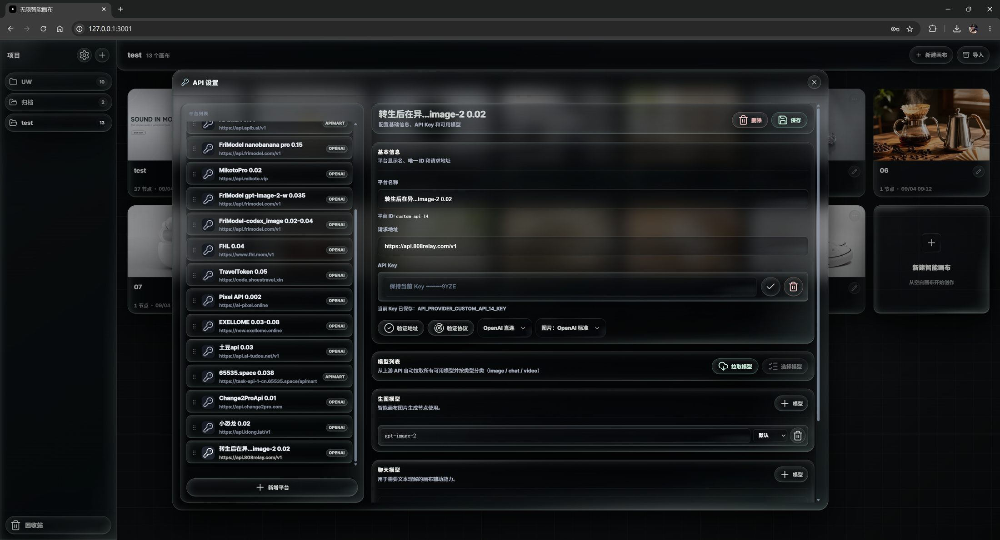
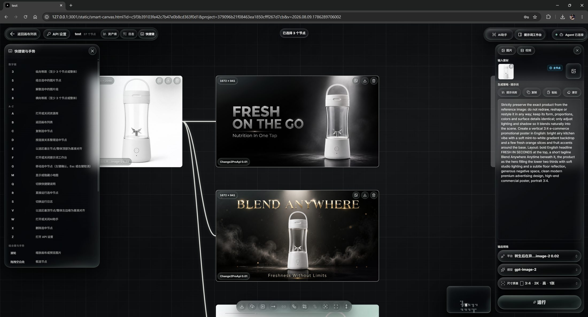
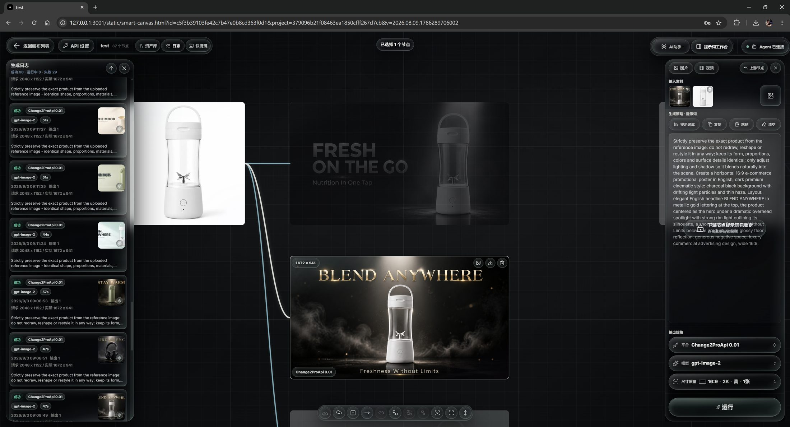
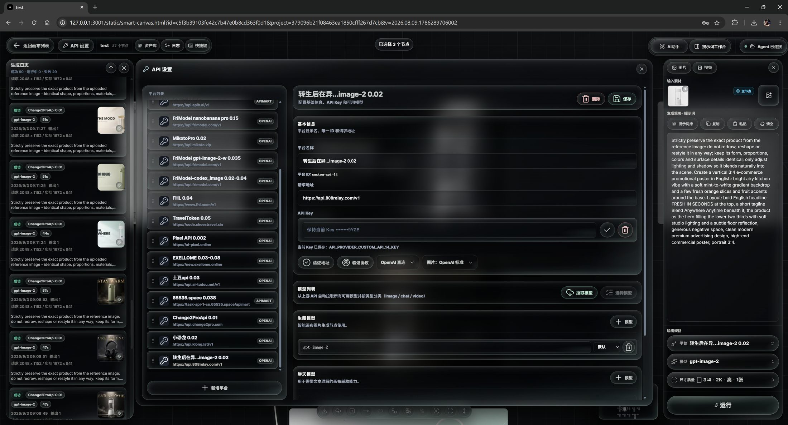

# 无限智能画布 · 玻璃拟态主题

[大雄画布](https://github.com/hero8152/Infinite-Canvas) 二创：整体重做为玻璃拟态（Glassmorphism）视觉的本地无限画布。Windows 本地优先，节点式串联文生图 / 图生图 / 视频生成，内置提示词工作台、视觉助手、素材库与生成日志。

> **English:** A glassmorphism-themed remake of [Infinite-Canvas](https://github.com/hero8152/Infinite-Canvas) — a local-first infinite canvas that chains text-to-image / image-to-image / video generation as nodes (FastAPI + Vanilla JS, Windows-ready).






## 运行

双击 `run.bat`（使用本目录内置 Python 环境），浏览器访问 <http://127.0.0.1:3001>。

也可使用自备的 Python 3.10+：

```bash
pip install -r requirements.txt
copy API\.env.example API\.env   # 按需填写 API 密钥
python main.py
```

环境变量说明见 `API/.env.example`；迁移与使用细节见 [运行说明.txt](运行说明.txt)。`API/.env`、`data/`、`assets/` 属于本地数据与私密配置，不进入版本库。

本地镜像的字体、图标库及许可证说明见 `static/vendor/THIRD_PARTY_LICENSES.md`。

## 许可证

本项目根据 [大雄画布](https://github.com/hero8152/Infinite-Canvas) 二次开发，仅供学习与个人使用，禁止商业用途，详见 [LICENSE](LICENSE)。
